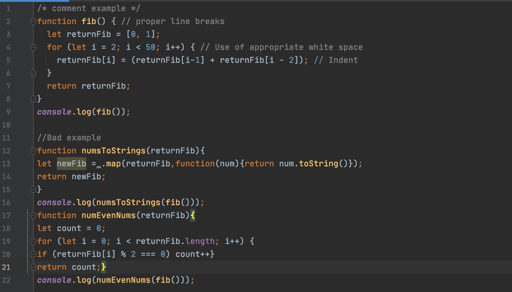
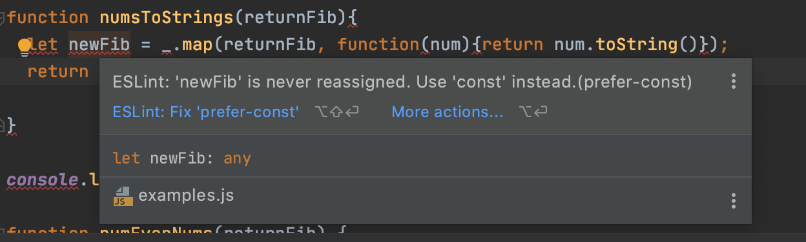
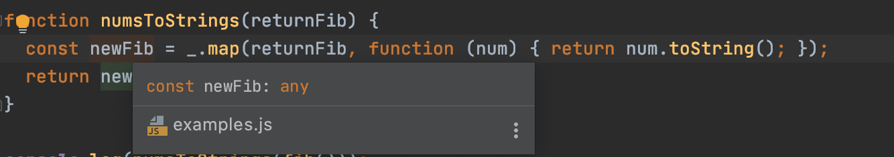

 
 

 

## Good coding is good writing, good code is good writing

<ul>
Today I thought a lot about essays and program coding, and I realized that 'coding' was no different from 'writing'. Coding and writing have a lot in common, such as creating something from nothing, shaping the clues of invisible thoughts into visible shapes, working alone, but constantly paying attention to the world and the thoughts of others. Also, coding is writing that expresses one's thoughts. We do essay assignments in class. However, the task to write essays for us is not to make all the students into writers, but to write the essay task because it helps to share our ideas systematically and logically with many people. Therefore, what we write and learn to code is not just learning the techniques of programming through coding, we can directly think about what to code and how to code (such as creative and logical, computer thinking) and create the desired function. It will be a good opportunity for us to create many things!
 
 
 
  
## Complying with coding standards is a good way of skill-up

First of all, the format of a basic English essay follows the format of <Introduction> <Body> <Conclusion>. In coding, there are also some formats and rules of coding standards, like essays. Developers who code are coded according to a set rule, a coding standard. But what if not? Of course, if the content is coded by ourselves, we can easily grasp the content and find the desired part easily. However, when the size of the project grows, several people can code together, so we cannot stick to our own style. That's why we have to think about and adhere to the importance of coding standards to avoid this situation. Because there are guidelines or standards in the coding standard rules, developers can code accordingly, so you can code more efficiently. 
 
 
 

 
In programming, readability refers to the degree to which a program is easy to read. In other words, the high readability of the program means that anyone can see the program and understand it easily. So, what can we do to make your program more readable? If we code by following the detailed rules, the program will be highly readable.
 
 
 

## Conclusion 

Students taking classes according to the ICS314 class instructional guidelines have been using an IDE, which are 'IntelliJ' and ESLint to provide style guidance for a week. ESLint isn't quite familiar with how to use it yet, so I found a way to use it and I'm still immature, but I have no doubts believing that if you take advantage of the usefulness it provides us, we'll be able to write a bit more readable code. Coding according to standard rules will improve accuracy and efficiency in the development process, which will shorten development time.
 

 
Now we are ready to do good coding!
 
 
</ul>
 
 
 
 
 
 
