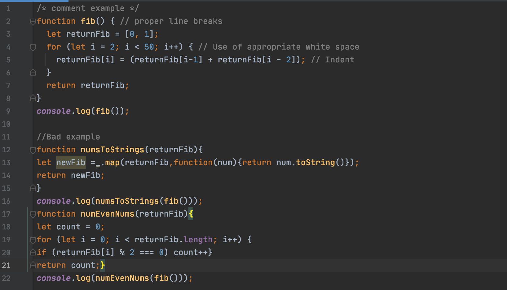
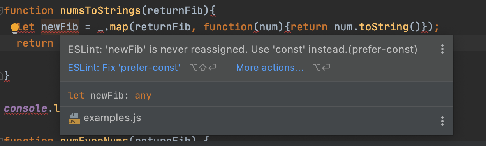

<br />
<br />
<p align="center">

</p>
 
## First impression of the design pattern

In the last class, our professor told us that the topic of the next essay was design patterns, and I thought it was a little new. The curriculum schedule for ICS 314 class has been based on understanding of programming and software. And on the one hand, I did not understand. Should the programmers also design? I thought. However, I have to write an essay, so in the process of searching and understading data on design patterns, the design patterens of software engineering will be little different from what I imagined.  

<br />
<br />
<br />
  
## Meaning of the name design pattern (dictionary meaning)

To understand what a design pattern is, let's check the dictionary meaning of the name "design pattern".
<br />
Design pattern is a combination of the two words design + pattern.
<br />

```
< design >
noun 
    1. a drawing or set of drawings showing how a building or product is to be made and how it will work and look
    2. the art of making plans or drawings for something
    3. the way in which something is planned and made

verb
    1. to make or draw plans for something, for examples clothes or buildings
    2. to intend
```

In other words, we can think of "design" as something like a plan or design to make something.
<br />

```
< pattern >
noun
    1. a particular way in which something is done, is organized, or happens
    2. any regularly repeated arrangement, especially a design made from repeated lines, shapes, or colours on a surface
    3. something that is used as an example, expecially to copy
```
In other words, it can be thought that "pattern" is a specific aspect in which something is done, and it refers to something that has a repetitive form.
<br />
<br />
<br />


## Conclusion 


<br />
<br />
<br />
<br />
  
## Conclusion 


Students taking classes according to the ICS314 class instructional guidelines have been using an IDE, which are 'IntelliJ' and ESLint to provide style guidance for a week. ESLint isn't quite familiar with how to use it yet, so I found a way to use it and I'm still immature, but I have no doubts believing that if you take advantage of the usefulness it provides us, we'll be able to write a bit more readable code. Coding according to standard rules will improve accuracy and efficiency in the development process, which will shorten development time.
<br />

<br />
 Now we are ready to do good coding!
  
<br />
<br />
<br />
<br />
<br />
<br />
