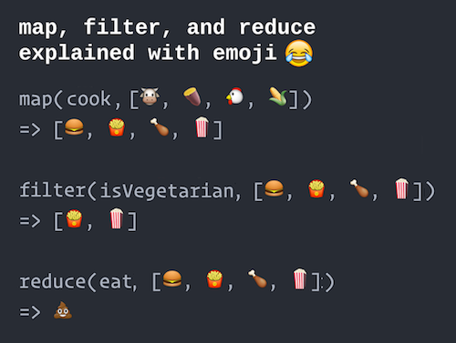

 
 

 
## A developer who wants to be worked with

A good developer is a developer who writes code that guarantees extensibility and readability in consideration of the development environment and required specifications? They write code that is easy to understand, maintainable and versatile for the developers they work with. In order to write the above-mentioned maintainable and scalable code, you need to be familiar with the programming language and framework you use, as well as general clean code writing techniques. Maybe more study is needed than now.
 
 
 
  
## What is functional programming?

Functional programming refers to a method of developing software by combining functions. The programming method used so far has been object-oriented programming. In object-oriented programming, software was developed by combining objects, but this time, the idea is to combine functions. The advantage of functional programming is that it emphasizes pure functions to reduce errors and combines pure functions to increase the level of modularity. When looking at the advantages of functional programming, there was the keyword concise expression; concise means easy to read, and if anyone who understands functional programming can easily read it, it means that it is easy to add or remove new features. Soon, easy-to-read code becomes safe code. Many of the advantages of functional programming eventually boil down to helping you write safe code. 
 
 
 
 

## Software development and design pattern

Design patterns are reusable solutions to problems that occur in software design in specific contexts in software engineering. It is not a complete design that can be converted directly to source or machine code, but is a description or template used to solve problems that can be used in different situations. Therefore, Design patterns present a common solution to object-oriented design problems. One of the advantages of becoming familiar with learning design patterns is that we can become familiar with these common issues. Once we and our team understand the design patterns, we can quickly catch up on what our colleagues intended for the design.
 
 
 
 
  
## Conclusion 

 

 
If the main paradigm of the language used is object-oriented, the solution to all problems is always object-oriented. However, most modern programming languages have multiple paradigms. In other words, learning to use different paradigms to suit your problem is one of the ways to evolve into a better developer.
 
 
 
 
 
 
