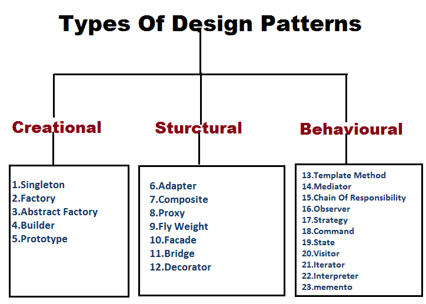

<br />
<br />
<p align="center">

</p>
 
## First impression of the design pattern

In the last class, our professor told us that the topic of the next essay was design patterns, and I thought it was a little new. The curriculum schedule for ICS 314 class has been based on understanding of programming and software. And on the one hand, I did not understand. Should the programmers also design? I thought. However, I have to write an essay, so in the process of searching and understading data on design patterns, the design patterens of software engineering will be little different from what I imagined.  
<br />
<br />
<br />
  
## Meaning of the name design pattern (dictionary meaning)

To understand what a design pattern is, let's check the dictionary meaning of the name "design pattern".
<br />
Design pattern is a combination of the two words design + pattern.
<br />
<br />

```
< design >
noun 
    1. a drawing or set of drawings showing how a building or product is to be made and how it will work and look
    2. the art of making plans or drawings for something
    3. the way in which something is planned and made

verb
    1. to make or draw plans for something, for examples clothes or buildings
    2. to intend
```
<br />
In other words, we can think of "design" as something like a plan or design to make something.
<br />
<br />

```
< pattern >
noun
    1. a particular way in which something is done, is organized, or happens
    2. any regularly repeated arrangement, especially a design made from repeated lines, shapes, or colours on a surface
    3. something that is used as an example, expecially to copy
```

<br />
In other words, it can be thought that "pattern" is a specific aspect in which something is done, and it refers to something that has a repetitive form.
<br />
<br />
Considering the dictionary meanings of the two words together, a design pattern is interpreted as a specific repetitive aspect of a plan to create something.
<br />
<br />
<br />

## Design patterns in software engineering 

<p align="center">

</p>
By definition, design patterns are common and reusable solutions to problems commonly encountered in software design. That means we don't have to rebuild something from scratch that's already well built, and works well. Software engineers face a lot of problem situations while developing their programs. It would be really useful if we remember how we solved the problem situation so that we can apply the solution when faced with a similar problem again. The most attractive of the software engineering design patterns I have chosen is that the "design pattern" is a reusable, proven solution that can be used when designing software or when chronic problems arise that often occur in certain situations. These solutions are well documented, already widely used, and proven to be reliable, reducing technical risk to our project.
<br />
<br />
<br />
<br />
  
## Conclusion 

<br />
<p align="center">

</p>
<br />
Design patterns help accelerate the development process by providing a proven development paradigm. Therefore, I believe that good developers understand design patterns, identify scenarios and problems that the pattern needs to solve in the software design process, and find and apply the appropriate pattern for that problem as one of the important factors.
<br />
<br />
<br />
<br />
<br />
<br />
