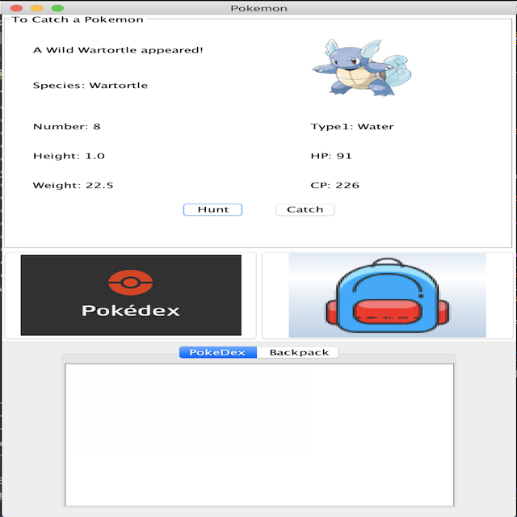

The PokeGUI project is to get creative and build a GUI (Graphical User Interface) for a hierarchy of Pokemon species that works similarly to Pokemon Go without GPS.

In the program, we wrote the program in such a way that we provide the user with a "Hunt" button to hunt, and the "Catch" button to obtain the hunted Pokémon if the user succeeds in the hunt, otherwise miss it. Also, since the Pokémon that can be hunted comes out randomly, we designed it to attract more interest to the user.

Since this program was conducted in groups, it was a little more fun and meaningful. The most interesting thing was that while studying Java in the ICS211 class, we were able to complete the project with fun because we made a topic that anyone called Pokemon would have encountered once in a while as a child. 
 
Source: [yejihan92/pokeGUI-ICS211-project](https://github.com/yejihan92/pokeGUI-ICS211-project).
