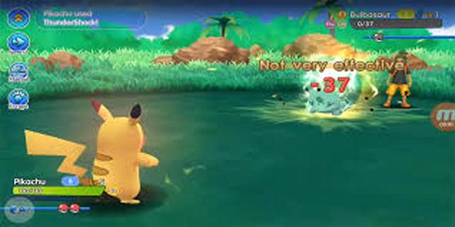

  

## Pokemon Battle!

The Pokemon Battle Game is probably the most interesting project among ICS211 projects. This was so much fun and I am sure it will be the most interesting to users of the projects I have ever created.

First of all, this project is largely classified into three categories. In the first step, we set up the game. For example, each player should choose one Pokemon to battle and then have a menu provided for battle. And in the second phase, players take turns fighting with the selected Pokémon. The final step is the game ends when one of the player's Pokémon is stunned.

What I feel most regretful about this project is the regrettable finish in terms of completeness. I think this is a project that feels insufficient in terms of completeness because time is tight. Every task is a fight against time. That's why it's really important to manage your time, but when the remaining time is over, it's most important to compromise the project's completeness appropriately and finish it in time.

More details for code: [yejihan92/ICS211-Pokemon-Battle-project](https://github.com/yejihan92/ICS211-Pokemon-Battle-project).

